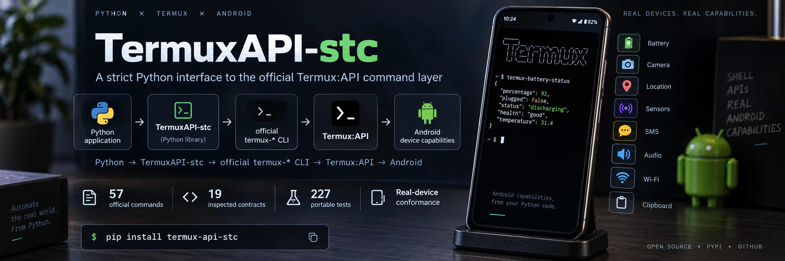

<div align="center">



# TermuxAPI-stc

### A strict Python interface to the official Termux:API command layer.

**Source-backed contracts · Explicit execution · Async support · Streaming · Real-device conformance**

<br>

[](https://pypi.org/project/termux-api-stc/)
[](https://pypi.org/project/termux-api-stc/)
[](LICENSE)

<br>

```bash
pip install termux-api-stc
```

**Current release:** `3.1.0a5` · **Python:** `3.10+` · **License:** `MIT`

</div>

---

## Python above. Android below. A strict boundary in between.

Termux:API exposes Android capabilities to the Termux environment through official command-line programs such as:

```bash
termux-battery-status
termux-camera-photo
termux-location
termux-sensor
termux-sms-list
termux-volume
```

Calling one of those commands from Python is trivial.

Building reliable software around them is not.

A real integration has to reason about:

* exact arguments;
* stdin;
* stdout;
* stderr;
* return codes;
* timeouts;
* subprocess lifetime;
* strict parsing;
* empty payloads;
* asynchronous execution;
* streaming;
* missing commands;
* hardware absence;
* Android permissions;
* semantic failures.

**TermuxAPI-stc provides that boundary.**

```text
Python application
        │
        ▼
   TermuxAPI-stc
        │
        ▼
official termux-* CLI
        │
        ▼
    Termux:API
        │
        ▼
      Android
```

It does not replace Termux:API.

It consumes its official command interface in a controlled, explicit and testable way.

---

# At a glance

|                                  | TermuxAPI-stc                                                |
| -------------------------------- | ------------------------------------------------------------ |
| **Purpose**                      | Consume the official Termux:API CLI from Python              |
| **Model**                        | Strict execution layer + source-backed high-level interfaces |
| **Official command baseline**    | **57 commands**                                              |
| **Inspected upstream contracts** | **19**                                                       |
| **Portable test suite**          | **227 tests**                                                |
| **Execution**                    | Sync, async and streaming                                    |
| **Parsing**                      | Bytes, strict UTF-8, JSON, optional JSON                     |
| **Shell execution**              | **No**                                                       |
| **Environment inspection**       | Yes                                                          |
| **Capability observation**       | Conservative and evidence-oriented                           |
| **Real Android qualification**   | Yes                                                          |
| **Python**                       | 3.10–3.14 tested                                             |
| **License**                      | MIT                                                          |

---

# Why this exists

A direct call looks simple:

```python
import subprocess

subprocess.run(["termux-battery-status"])
```

But once that command becomes infrastructure inside an application, several questions appear immediately:

```text
What arguments are valid?
What happens if stdout is empty?
What if JSON is malformed?
What if the command is missing?
What if the process hangs?
What if Android returns rc=0 but reports no hardware?
What if the capability exists but permission is missing?
What happens during async cancellation?
How should streaming commands be consumed?
```

TermuxAPI-stc makes those concerns part of the API contract instead of leaving them scattered across application code.

Its development model is intentionally evidence-driven:

```text
Official upstream source
        ↓
Normative contract
        ↓
Observed behavior
        ↓
Test
        ↓
STC implementation
        ↓
Conformance evidence
```

---

# Installation

```bash
pip install termux-api-stc
```

Current alpha explicitly:

```bash
pip install termux-api-stc==3.1.0a5
```

For real Android operations, the environment also requires a functioning Termux setup with the official Termux:API components installed.

---

# Quick start

## Battery status

```python
from termux_api_stc import battery

status = battery.status()

print(status)
```

Underlying official command:

```text
termux-battery-status
```

---

## Camera

```python
from termux_api_stc import camera

print(camera.info())

path = camera.photo(
    "/data/data/com.termux/files/home/photo.jpg",
    camera_id=0,
)

print(path)
```

TermuxAPI-stc handles the command boundary.

Android still determines whether:

* a camera exists;
* access is permitted;
* the camera ID is valid;
* the operation can actually complete.

---

## Location

```python
from termux_api_stc import location

position = location.get(
    provider="gps",
    request="once",
)

print(position)
```

Inspected providers:

```text
gps
network
passive
```

Bounded request modes exposed by the high-level API include:

```text
once
last
```

---

## Streaming location updates

```python
from termux_api_stc import location

for update in location.stream_updates(provider="gps"):
    print(update)
```

Continuous upstream behavior remains continuous.

TermuxAPI-stc does not silently transform a stream into polling.

---

# Async execution

```python
import asyncio

from termux_api_stc import battery


async def main():
    status = await battery.status_async()
    print(status)


asyncio.run(main())
```

Async support uses asynchronous subprocess management.

It is not merely synchronous execution hidden behind an async-looking wrapper.

---

# Raw official command facade

Not every official command needs a specialized high-level abstraction.

The complete pinned command inventory remains accessible:

```python
from termux_api_stc import TermuxAPI

api = TermuxAPI()

result = api["termux-battery-status"].json()

print(result)
```

Unknown commands are rejected:

```python
api["not-an-official-termux-command"]
# KeyError
```

This is deliberate.

The raw facade represents the known official command baseline, not arbitrary command execution.

---

# Two surfaces, one execution boundary

```text
                    TermuxAPI-stc
                         │
            ┌────────────┴────────────┐
            │                         │
            ▼                         ▼
   High-level wrappers          Raw command facade
            │                         │
  inspected semantics           official inventory
  validated arguments             57 commands
  parsed responses                   │
            │                         │
            └────────────┬────────────┘
                         │
                         ▼
                 Executor / Command
                         │
                         ▼
                official termux-* CLI
```

This avoids a false tradeoff between:

* exposing the complete official command surface; and
* pretending every command already has a rich, fully inspected wrapper.

---

# Execution model

At the core:

```text
TermuxAPI
    ↓
Command
    ↓
Executor
    ↓
official executable
```

Commands are executed directly as argument vectors.

```text
shell = false
```

There is no intermediate shell interpretation.

Each execution can preserve:

```text
argv
return code
stdout
stderr
duration
```

through `ExecutionResult`.

---

# Parsing is explicit

TermuxAPI-stc does not guess what stdout means.

The caller selects the representation:

```python
command.bytes()
command.text()
command.json()
command.json_if_present()
```

## Bytes

```python
payload = command.bytes()
```

Returns raw stdout.

---

## Text

```python
text = command.text()
```

Uses strict UTF-8 decoding.

Invalid text is not silently repaired into another representation.

---

## JSON

```python
data = command.json()
```

Requires valid JSON.

Malformed non-empty JSON raises:

```python
ProtocolError
```

---

## Optional JSON

Some successful official commands can legitimately emit no stdout.

```python
data = command.json_if_present()
```

Semantics:

```text
empty stdout
    ↓
None

non-empty valid JSON
    ↓
parsed value

non-empty invalid JSON
    ↓
ProtocolError
```

No implicit fallback.

---

# Process success is not capability success

A core rule of TermuxAPI-stc is:

```text
command exists
        ≠
command works

command works
        ≠
payload exists

exit code = 0
        ≠
semantic success

official executable exists
        ≠
hardware exists

hardware exists
        ≠
permission granted
```

This distinction matters on Android.

A process can return:

```text
rc = 0
```

while its payload reports:

```text
ERROR_NO_HARDWARE
```

That is not the same thing as a working capability.

TermuxAPI-stc preserves the difference.

---

# Capability observation

```python
from termux_api_stc import observe_command

observation = observe_command(
    "termux-infrared-frequencies"
)

print(observation.state)
print(observation.evidence)
```

Capability states include:

```text
AVAILABLE
UNAVAILABLE
PERMISSION_REQUIRED
UNSUPPORTED
UNKNOWN
```

Observation is intentionally conservative.

For example:

```text
return code = 0
stdout = empty
```

does not automatically prove:

```text
AVAILABLE
```

when positive payload evidence would be required for that claim.

---

# Environment inspection

```python
from termux_api_stc import inspect_environment

environment = inspect_environment()

print(environment)
```

`EnvironmentReport` can expose evidence including:

```text
Termux environment
Termux prefix
home directory
Android release
Android API level
manufacturer
device model
ABI
Termux version
termux-api package version
official command availability
```

Environment inspection answers:

> **What is present?**

It does not automatically answer:

> **What will work?**

That distinction is preserved throughout the library.

---

# Capability surface

TermuxAPI-stc currently exposes structured interfaces across areas including:

| Capability                | Interface examples                         |
| ------------------------- | ------------------------------------------ |
| **Battery**               | status                                     |
| **Audio**                 | audio information                          |
| **Volume**                | inspect and modify streams                 |
| **Brightness**            | display brightness                         |
| **Camera**                | information, photo capture                 |
| **Clipboard**             | read, write                                |
| **Contacts**              | list                                       |
| **Calls**                 | call log                                   |
| **Location**              | once, last, updates                        |
| **Sensors**               | list, read, continuous output              |
| **Microphone**            | recording lifecycle                        |
| **Fingerprint**           | authentication request                     |
| **Infrared**              | frequencies, transmission                  |
| **Notifications**         | create, list, remove                       |
| **Notification channels** | create, remove                             |
| **SMS**                   | list, send                                 |
| **Speech**                | speech-to-text                             |
| **Sharing**               | Android share interface                    |
| **Storage**               | Android storage interaction                |
| **Telephony**             | call, cell and device information          |
| **Toast**                 | transient Android messages                 |
| **Torch**                 | flashlight control                         |
| **TTS**                   | engines, speech                            |
| **Vibration**             | vibration                                  |
| **Wallpaper**             | local file or URL                          |
| **Wi-Fi**                 | connection, scan information, enable state |

This table describes the library surface.

It is **not** a claim that every listed capability is usable on every Android device.

Actual behavior can depend on:

```text
Android API level
permissions
hardware
device manufacturer
Termux configuration
current device state
user interaction
```

---

# Source-backed contracts

A high-level wrapper should not exist merely because an API shape looks convenient.

For inspected commands, TermuxAPI-stc records upstream evidence.

```python
from termux_api_stc import INSPECTED_CONTRACTS

for command, contract in INSPECTED_CONTRACTS.items():
    print(command, contract)
```

The current 3.1 line distinguishes two separate surfaces:

```text
57 official commands
        │
        └── pinned raw inventory

19 inspected upstream contracts
        │
        └── stronger high-level modeling
```

These numbers intentionally mean different things.

---

# Official baseline

The 3.1 line was developed against a pinned upstream baseline:

```text
Termux:API
v0.53.0

termux/termux-api-package
pinned package tree SHA:
0e3f9222eea7760c76ea6368dadbdf884ab85fbf

official command inventory:
57
```

The identifier above is a **package tree SHA**.

It is not described as the repository commit SHA.

---

# Error model

```python
from termux_api_stc import (
    CommandUnavailableError,
    ExecutionError,
    ExecutionTimeoutError,
    ProtocolError,
)
```

## `CommandUnavailableError`

The requested executable cannot be found.

---

## `ExecutionError`

The executable ran but returned a non-zero status.

Execution evidence is preserved.

---

## `ExecutionTimeoutError`

The process exceeded its configured timeout.

---

## `ProtocolError`

A selected parser received a non-empty payload that violated the expected representation.

Example:

```text
expected JSON
received malformed non-empty output
```

---

# Android semantic failures are different

Not every Android-level problem is an execution failure.

For example:

```text
process
    rc = 0

payload
    ERROR_NO_HARDWARE
```

is fundamentally different from:

```text
process
    rc != 0
```

TermuxAPI-stc does not collapse both situations into the same error model.

---

# Validation is layered

Portable Python tests and real-device tests answer different questions.

```text
┌──────────────────────────┐
│   Portable validation    │
└────────────┬─────────────┘
             │
             ▼
 argv construction
 parsing
 errors
 sync execution
 async execution
 timeout behavior
 subprocess cleanup
 streaming
 registries


┌──────────────────────────┐
│   Device conformance     │
└────────────┬─────────────┘
             │
             ▼
 TermuxAPI-stc
      ↓
 official CLI
      ↓
 Termux:API
      ↓
 real Android device
```

Passing the first does not imply passing the second.

---

# `3.1.0a5` qualification snapshot

| Qualification                       |             Result |
| ----------------------------------- | -----------------: |
| Portable Python suite               | **227 / 227 PASS** |
| CI Python 3.10                      |           **PASS** |
| CI Python 3.11                      |           **PASS** |
| CI Python 3.12                      |           **PASS** |
| CI Python 3.13                      |           **PASS** |
| CI Python 3.14                      |           **PASS** |
| Android readonly                    |   **19 / 19 PASS** |
| Android safe-effects                |   **10 / 10 PASS** |
| Android qualification               |   **29 / 29 PASS** |
| Installed-wheel qualification       |   **29 / 29 PASS** |
| Repeated installed qualification    |   **29 / 29 PASS** |
| Clean PyPI installation             |           **PASS** |
| `pip check` after PyPI installation |           **PASS** |

These results are evidence for the tested release and reference environment.

They are **not a universal Android compatibility claim**.

---

# Real-device qualification

Device campaigns are separated according to operational effect:

```text
readonly
safe-effects
qualification
interactive
sensitive
```

This is intentional.

Testing:

```text
battery status
```

is operationally different from testing:

```text
camera
microphone
SMS
sharing
biometrics
```

Interactive and externally visible actions are not silently hidden inside ordinary automated campaigns.

---

# Designed as infrastructure

TermuxAPI-stc is intentionally narrow enough to be used beneath larger software systems.

```text
┌───────────────────────────────────────┐
│            Your application           │
├───────────────────────────────────────┤
│ authorization                         │
│ networking                            │
│ RPC                                   │
│ persistence                           │
│ business logic                        │
│ user interface                        │
├───────────────────────────────────────┤
│             TermuxAPI-stc             │
├───────────────────────────────────────┤
│ command contracts                     │
│ subprocess execution                  │
│ parsing                               │
│ async lifecycle                       │
│ streams                               │
│ environment observation               │
├───────────────────────────────────────┤
│              Termux:API               │
├───────────────────────────────────────┤
│                Android                │
└───────────────────────────────────────┘
```

Application concerns remain outside the library.

---

# What TermuxAPI-stc does not claim

TermuxAPI-stc is not:

* an Android SDK;
* an Android automation framework;
* a replacement for Termux;
* a replacement for Termux:API;
* a replacement for `termux-api-package`;
* a private Binder or Intent integration;
* a remote administration protocol;
* an authorization system;
* a permission manager;
* a device compatibility database;
* a guarantee that particular hardware exists;
* a guarantee that Android will grant a permission;
* a universal compatibility claim across Android vendors;
* a normalization layer that fabricates consistent semantics where upstream does not provide them.

Its responsibility is narrower:

> **Provide a strict Python boundary around the official Termux:API command interface.**

---

# Runtime stack

```text
Android
  ↓
Termux
  ↓
Termux:API companion application
  ↓
termux-api package
  ↓
Python 3.10+
  ↓
TermuxAPI-stc
```

Individual operations can additionally depend on:

```text
hardware
permissions
Android API level
manufacturer behavior
user interaction
runtime state
```

---

# Development

Install with test dependencies:

```bash
python -m pip install -e '.[test]'
```

Run the portable suite:

```bash
./tests/run-tests.sh
```

Run real-device campaigns in Termux:

```bash
./tests/run-device-tests.sh readonly

./tests/run-device-tests.sh safe-effects

./tests/run-device-tests.sh qualification
```

Interactive and sensitive campaigns remain separate by design.

---

# Validation documentation

For deeper technical detail:

```text
PRE_RELEASE.md
VALIDATION.md
EVOLUTION.md
specification.md
docs/upstream-contracts.md
tests/device/README.md
```

These documents describe:

* qualification rules;
* evidence semantics;
* source-backed contracts;
* device-test methodology;
* release evolution.

---

# Package identity

| Context               | Name             |
| --------------------- | ---------------- |
| **Presentation name** | `TermuxAPI-stc`  |
| **PyPI distribution** | `termux-api-stc` |
| **Python import**     | `termux_api_stc` |
| **Current release**   | `3.1.0a5`        |

Install:

```bash
pip install termux-api-stc
```

Import:

```python
import termux_api_stc
```

---

# Release status

```text
3.1.0a5
ALPHA
```

The alpha designation is intentional.

The release has substantial automated and real-device qualification, while the richer source-backed high-level contract surface is still evolving.

A qualified reference device does not justify claiming universal Android behavior.

---

# Engineering philosophy

```text
NO SPECIFICATION
        ↓
NO IMPLEMENTATION

NO EVIDENCE
        ↓
NO COMPATIBILITY CLAIM

NO UPSTREAM CONTRACT
        ↓
NO PUBLIC HIGH-LEVEL API
```

When the official command interface provides a contract, the library can model it.

When runtime observation provides evidence, the library can report it.

When neither exists, the library should not invent certainty.

---

<div align="center">

# TermuxAPI-stc

### Python above. Android below. A strict boundary in between.

```bash
pip install termux-api-stc
```

**Open source · PyPI · MIT · Python 3.10+**

</div>
